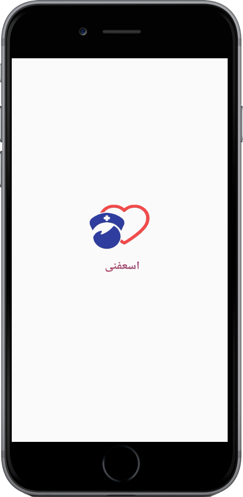

# Es3fni For Admin (Flutter Application)

It is an control panel of the Es3fni application that allows administrators to view all requests and controls with nurses and services, using providers as state Management, firebase as backend and google map.

## Features for admins

* Allow admins to:
  * View all requests and view the profile of the nurse who accepted the request.
  * Show users in the app and accepted users if the users data is correct.
  * Add or remove nurses.
  * View the nurse's profile and all supplies.
  * Collect points from nurses.
  * Add new services.
  * Add discount coupons for users.
  * View all archived requests with the ability to:
    * View all details of the order.
    * View user profile.
    * View the profile of the nurse who accepted the user's request.
  * Add requests for users who cannot add requests.
* Change the language.

#### For using app
 [download android apk](https://drive.google.com/drive/folders/1qKFybKgjddpFpk3nOj3xl2s6H-WmRytC?usp=sharing)

#### Features for users and nurses
[Es3fni repository](https://drive.google.com/drive/folders/1qKFybKgjddpFpk3nOj3xl2s6H-WmRytC?usp=sharing)

#### Code Quality

* work with null safety.
* Write readable and reusable code.
* Use single responsibility for functions.
* Reduce unnecessary requests for the Firebase.
* Easy to modify user interface.

## Screenshots

&nbsp;

&nbsp;

&nbsp;

&nbsp;

&nbsp;

&nbsp;

&nbsp;

&nbsp;

&nbsp;

&nbsp;

#### Dependencies:

- localize_and_translate
- provider
- animated_text_kit
- firebase_core
- cloud_firestore
- firebase_storage
- google_maps_flutter
- geocoding
- firebase_auth
- shared_preferences
- flutter_launcher_icons
- curved_navigation_bar
- toast
- shimmer
- photo_view
  
# What's Next?
 - [ ] Add notifications.
 - [ ] Add new Animation.
 - [ ] Add new features.